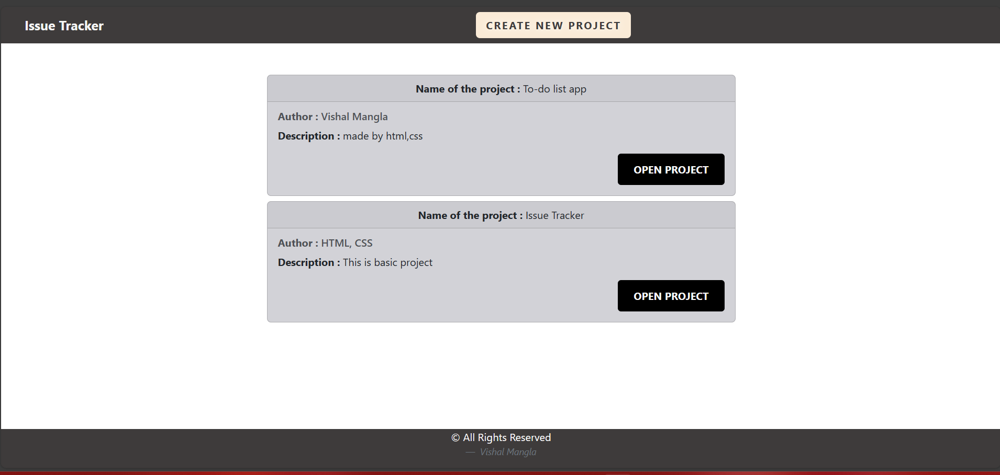
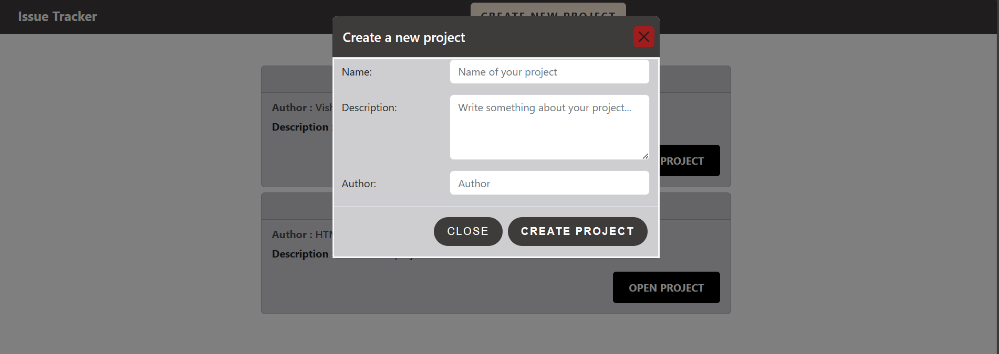
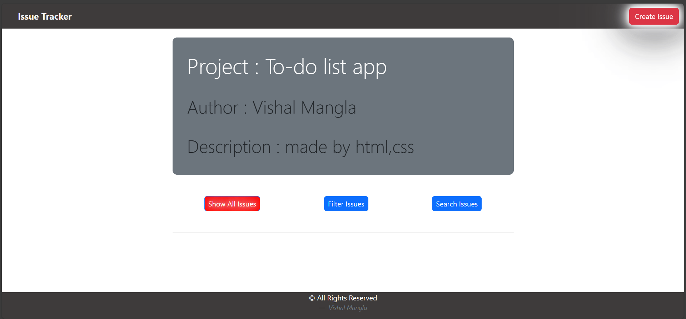
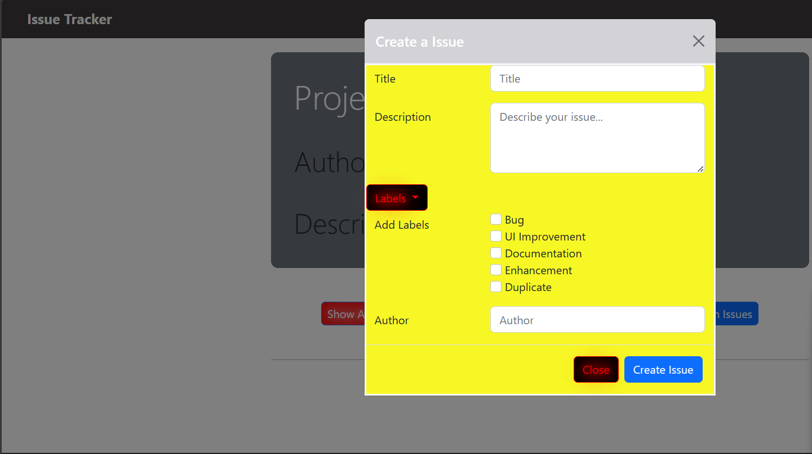
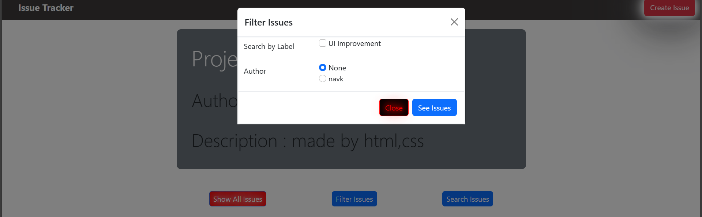
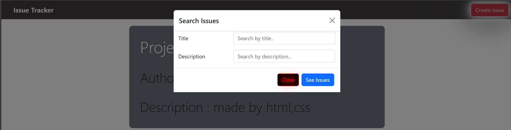
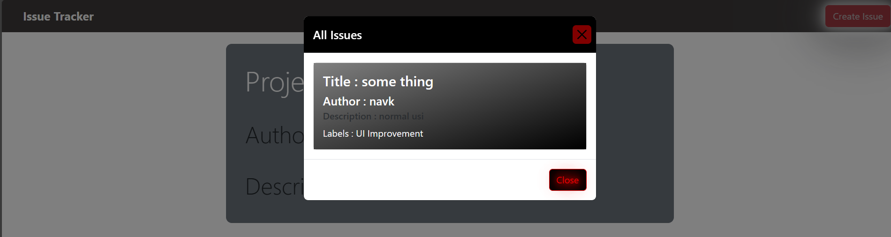

# Issue Tracker

## Images

This is an issue tracker application built using Node.js and EJS. It allows users to track issues/bugs for different projects. The application provides a user interface to create projects, view project details, filter issues, and create new issues.

## Features

- Neat UI with a home page showing a list of projects.
- Ability to create a new project with name, description, and author.
- Project detail page to view bugs related to a specific project.
- Filter issues by multiple labels, author, and search by title and description.
- Create new issues for a project with a title, description, labels, and author.

## Prerequisites

- Node.js (version X.X.X)
- npm (version X.X.X)

## Installation
# Clone the repository
git clone https://github.com/vishal9151/Issue_Tracker.gihub.io.git

# Navigate to the project directory
cd issue-tracker

# Install the dependencies
npm install

# Start the application
nodemon index.js
